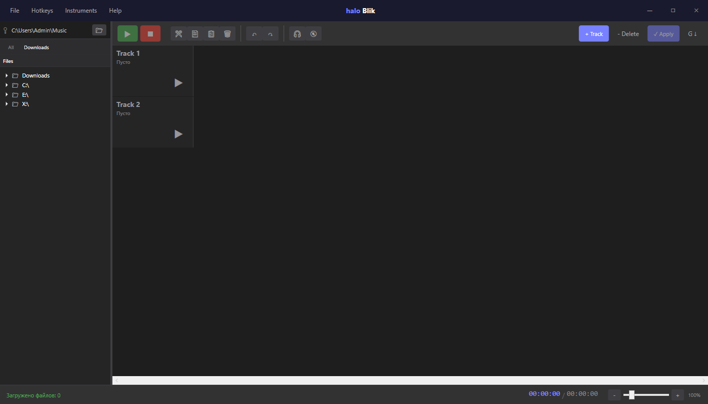
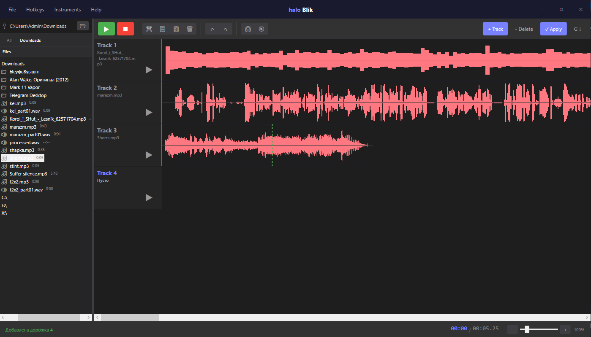
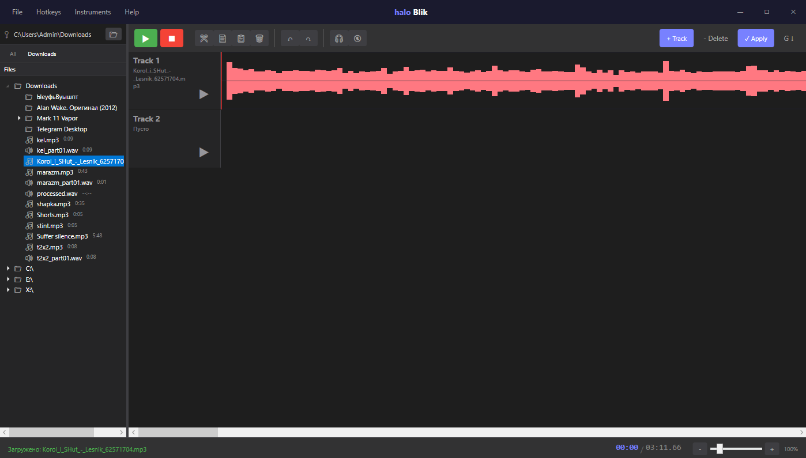

# 🎵 AudioStudio

[](https://github.com/entitiwhole/audio-studio/releases)
[](LICENSE)
[](https://dotnet.microsoft.com/)

```
███╗   ███╗ █████╗ ███╗   ██╗ █████╗ ██╗     
████╗ ████║██╔══██╗████╗  ██║██╔══██╗██║     
██╔████╔██║███████║██╔██╗ ██║███████║██║     
██║╚██╔╝██║██╔══██║██║╚██╗██║██╔══██║██║     
██║ ╚═╝ ██║██║  ██║██║ ╚████║██║  ██║███████╗
╚═╝     ╚═╝╚═╝  ╚═╝╚═╝  ╚═══╝╚═╝  ╚═╝╚══════╝
         S T U D I O
```

> 🖥️ Аудио редактор для Windows с Timeline, визуализацией waveform и эффектами обработки звука

---

## ✨ Возможности

### 📂 Браузер файлов
- Загрузка аудио из любой папки
- Поддержка форматов: **WAV, MP3, FLAC, OGG, M4A, AIFF**
- Быстрая навигация по дискам
- Фильтры: Все файлы / Downloads

### 🎞️ Timeline
- Визуализация waveform для каждого клипа
- Горизонтальная прокрутка колёсиком мыши
- Зум (Ctrl + колёсико)
- Точное позиционирование

### ✂️ Редактирование
| Действие | Горячая клавиша |
|----------|-----------------|
| Вырезать | `Ctrl + X` |
| Копировать | `Ctrl + C` |
| Вставить | `Ctrl + V` |
| Отменить | `Ctrl + Z` |
| Повторить | `Ctrl + Y` |

### 🎧 Эффекты обработки
- **LowPass** - низкочастотный фильтр
- **HighPass** - высокочастотный фильтр  
- **Gain** - усиление/ослабление
- **Echo** - эхо
- **Reverb** - реверберация

### ⌨️ Горячие клавиши
| Клавиша | Действие |
|---------|----------|
| `Space` | Воспроизведение / Пауза |
| `Enter` | Стоп |
| `Home` | В начало трека |
| `End` | В конец трека |
| `Delete` | Удалить выделенное |
| `Ctrl + D` | Выделить всё |

---

## 📥 Скачать

📦 **[AudioStudio-Setup-1.0.0.exe](https://github.com/entitiwhole/audio-studio/releases/latest)**  
⬇️ Установщик для Windows 10/11 (x64)

---

## 🖥️ Скриншоты

*[Добавь скриншоты после установщика]*
```
📷 Главное окно


📷 Timeline с клипами


📷 Браузер файлов

```

---

## 🛠️ Сборка из исходников

### Требования
- Windows 10/11
- [.NET 10 SDK](https://dotnet.microsoft.com/download/dotnet/10.0)
- [Inno Setup 6](https://jrsoftware.org/isinfo.php) (для создания установщика)

### Команды

```bash
# Клонировать репозиторий
git clone https://github.com/entitiwhole/audio-studio.git
cd audio-studio

# Сборка
dotnet build AudioStudio/AudioStudio.csproj -c Release

# Публикация
dotnet publish AudioStudio/AudioStudio.csproj -c Release -r win-x64 --self-contained true -o ./publish

# Создать установщик (через Inno Setup)
# Открой AudioStudioInstaller/AudioStudio.iss в Inno Setup Compiler
```

---

## 📁 Структура проекта

```
audio-studio/
├── AudioStudio/
│   ├── Models/           # Модели данных
│   ├── Services/         # Аудио движок, эффекты
│   ├── Views/            # UI компоненты
│   ├── Properties/       # Метаданные сборки
│   ├── MainWindow.xaml   # Главное окно
│   └── AudioStudio.csproj
├── AudioStudioInstaller/
│   └── AudioStudio.iss   # Скрипт Inno Setup
├── AudioStudio.sln
└── README.md
```

---

## 🧪 Технологии

| Компонент | Технология |
|-----------|------------|
| Фреймворк | WPF (.NET 10) |
| Аудио | NAudio 2.2.1 |
| Сборка | .NET SDK |
| Установщик | Inno Setup 6 |

---

## 📄 Лицензия

Проект распространяется под лицензией **MIT**.  
Подробности в файле [LICENSE](LICENSE).

---

## 🙏 Благодарности

- [NAudio](https://github.com/naudio/NAudio) - библиотека для работы со звуком
- [Inno Setup](https://jrsoftware.org/isinfo.php) - создание установщика

---

*Если проект полезен - поставь ⭐ звезду!* ⭐
