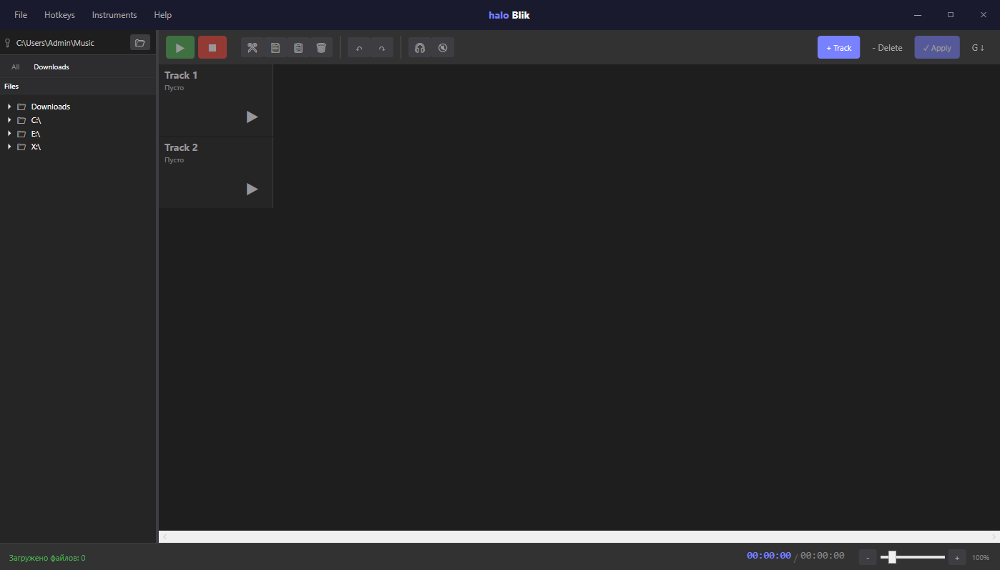
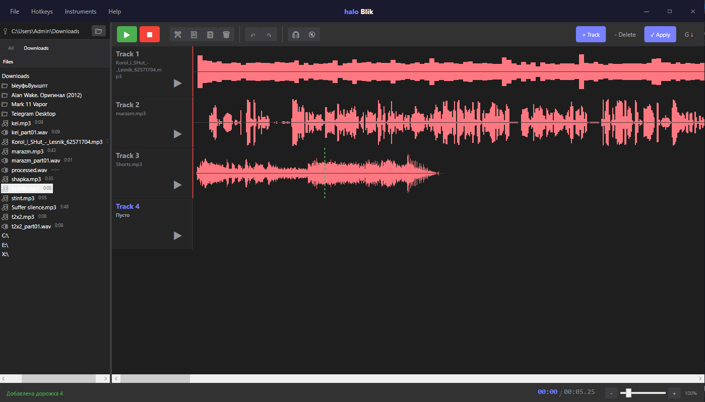
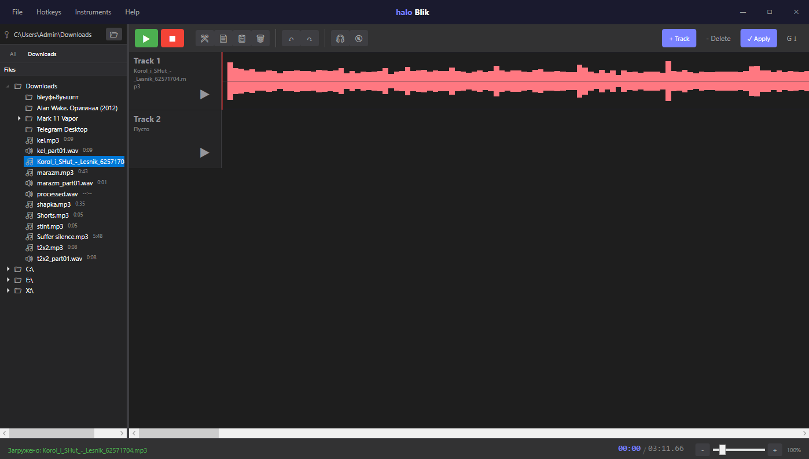

# Bnote

**Аудиоредактор для Windows** — плейлист, timeline, waveform и обработка звука в стиле DAW.

<p align="center">
  <a href="https://github.com/entitiwhole/audio-studio/releases"></a>
  <a href="LICENSE"></a>
  
  
</p>

<p align="center">
  <sub>PRYTEK Vision</sub>
</p>

---

## О проекте

Bnote — настольное WPF-приложение для работы с аудио на нескольких дорожках.  
Импорт файлов, расстановка клипов на плейлисте, редактирование фрагментов, эффекты и экспорт проекта.

---

## Возможности

### Плейлист

- Несколько дорожек с клипами и осциллограммой
- Drag-and-drop из браузера файлов
- Множественное выделение: `Ctrl+клик`, `Shift+клик`, `Ctrl+Shift+ЛКМ`
- Групповое перетаскивание выделенных клипов
- Склейка клипов на одной дорожке
- Перемещение с ограничением по границам соседних клипов
- Undo / Redo для операций с клипами

### Браузер и импорт

- WAV, MP3, FLAC, OGG, M4A, AIFF
- Навигация по дискам и папкам
- Быстрое добавление на выбранную дорожку

### Timeline и воспроизведение

- Waveform и spectrogram для клипов
- Горизонтальная прокрутка и зум (`Ctrl` + колёсико)
- Playhead, перемотка, loop-режим

### Редактирование

| Действие | Клавиша |
|----------|---------|
| Вырезать | `Ctrl+X` |
| Копировать | `Ctrl+C` |
| Вставить | `Ctrl+V` |
| Отменить | `Ctrl+Z` |
| Повторить | `Ctrl+Y` |
| Выделить всё | `Ctrl+D` |
| Удалить | `Delete` |

### Воспроизведение

| Клавиша | Действие |
|---------|----------|
| `Space` | Play / Pause |
| `Enter` | Stop |
| `Home` | В начало |
| `End` | В конец |

### Эффекты

Low-pass, High-pass, Gain, Echo, Reverb — через окно **Instruments** с предпрослушиванием.

---

## Скачать

**[Releases](https://github.com/entitiwhole/audio-studio/releases/latest)** — установщик `Bnote-Setup-x.x.x.exe` для Windows 10/11 (x64, self-contained).

---

## Скриншоты

| Главное окно | Плейлист |
|:---:|:---:|
|  |  |

| Браузер файлов |
|:---:|
|  |

---

## Сборка

### Требования

- Windows 10/11 (x64)
- [.NET 10 SDK](https://dotnet.microsoft.com/download/dotnet/10.0)
- [Inno Setup 6](https://jrsoftware.org/isinfo.php) — для установщика

### Команды

```powershell
git clone https://github.com/entitiwhole/audio-studio.git
cd audio-studio

# Debug / Release
dotnet build AudioStudio\AudioStudio.csproj -c Debug
dotnet build AudioStudio\AudioStudio.csproj -c Release

# Публикация (self-contained)
dotnet publish AudioStudio\AudioStudio.csproj -c Release -o publish

# Установщик
& "C:\Program Files (x86)\Inno Setup 6\ISCC.exe" BFStudio.iss
```

Артефакты сборки:

| Конфигурация | Путь |
|--------------|------|
| Debug | `AudioStudio\bin\Debug\AudioStudio.exe` |
| Release | `AudioStudio\bin\Release\AudioStudio.exe` |
| Publish | `publish\AudioStudio.exe` |
| Installer | `Output\Bnote-Setup-x.x.x.exe` |

---

## Структура

```
audio-studio/
├── AudioStudio/              # WPF-приложение
│   ├── Commands/             # Undo/Redo, операции плейлиста
│   ├── Models/               # Клипы, проект, view models
│   ├── Services/             # Аудио, проект, целостность плейлиста
│   ├── Views/                # PlaylistView, Timeline, UI
│   └── MainWindow.xaml
├── AudioBridge/              # Native-эффекты (C++)
├── AudioStudioInstaller/     # app.ico, ресурсы установщика
├── BFStudio.iss              # Inno Setup
├── Directory.Build.props     # SemVer
├── version.json              # Версия релиза
└── publish/                  # Выход publish
```

---

## Стек

| | |
|---|---|
| UI | WPF, .NET 10 |
| Аудио | NAudio 2.2.1 |
| Установщик | Inno Setup 6 |
| Версионирование | SemVer (`version.json`) |

---

## Лицензия

[MIT](LICENSE) · PRYTEK Vision
